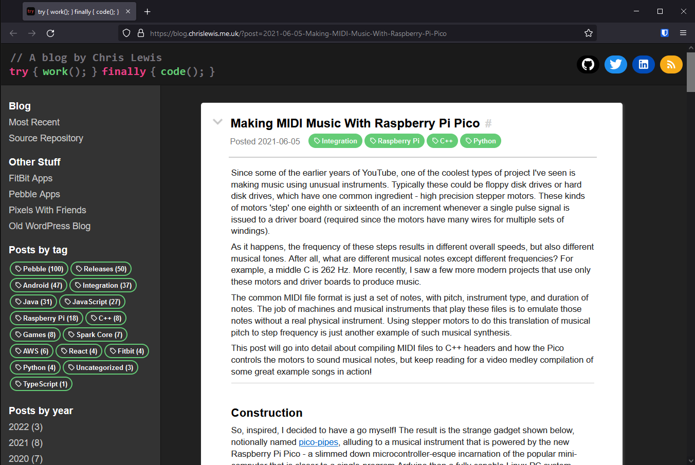
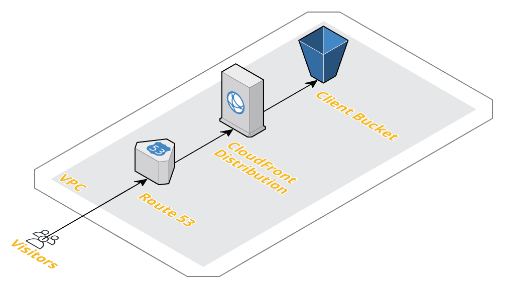

# blog

Time to roll my own. So long, WordPress!




## Post format

Blog posts are written in a simplified Markdown format in `posts`. These are
later converted into JSON objects that can be rendered as components:

* First line is the title.

* Second line is the date and time in `YYYY-MM-DD HH:MM` format.

* This line is a comma-separated list of tags.

* Body comes afer line containing '---'.

* Each paragraph is treated as a block of text (double newline break).

* Images `` are converted to ``.

* Headings are standard header levels with a space beween hash and text.

* Links `[desc](url)` are converted to `<a>`.

* Lines starting with '- ' are converted to bullet lists using tables.

* Code highlighting uses Markdown triple backticks followed by the language name.


## Building the blog

All posts in `posts` are built using their metadata to create component lists
that are rendered on the page, and are placed in `assets/rendered`.

```
./pipeline/build-site.sh
```

The navigation of months per year is built during `tools/buildPosts.js` as
`assets/history.json`.

After building, opening `index.html` and selecting a year and month will show
all the posts from `assets/history.json` referring to their rendered components
which can then be displayed.

The chosen month or post is reflected in the query for permalinking.


## Deployment



Currently deployed as a S3 website from bucket, with a CloudFront distribution
serving HTTPS with a ACM certificate. The deployment is done with a combination
of Terraform and AWS CLI. It can be syncronized and invalidated with an AWS IAM
User with S3 and CloudFront permissions allowed:

```
export AWS_PROFILE=...

./deploy.sh
```


## Import from WordPress

> No longer used - posts already imported to be modified instead of the originals

1. Copy xml from WordPress to `assets/export`.

2. Run `tools/importWordpressXml.js` to convert to a list of posts in
   `assets/import/posts.json`:

```
node tools/importWordpressXml.js assets/export/tryworkfinallycode.wordpress.2020-06-13.001.xml
```

The format of the import is as follows:

```json
[
  {
    "id": "2",
    "title": "Here it is",
    "link": "https://ninedof.wordpress.com/2013/03/21/here-it-is/",
    "pubDate": "Thu, 21 Mar 2013 15:16:22 +0000",
    "postDate": "2013-03-21 15:16:22",
    "body": "<p>So I've finally started that blog idea I'd had my eye on for a while ..."
  },
  ...
]
```

3. Run `tools/createWordpressMarkdown.js` to create imported cleaned-up Markdown
   files, which should be later tidied up into proper posts files (see above).
   Each file placed in `posts/` will have substitutions made to ease the
   transition.

```
node tools/createWordpressMarkdown.js
```

Then, build as usual.
